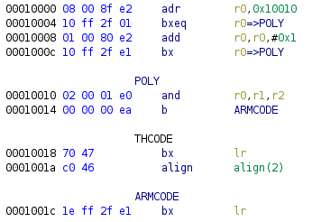
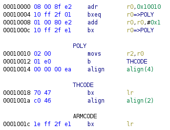
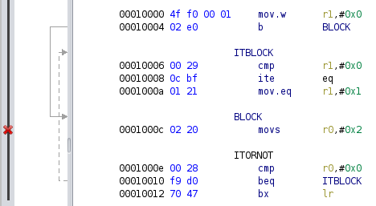
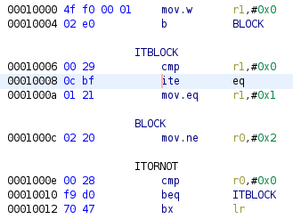
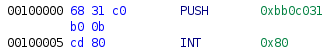
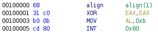

# Work in Progress

I'm not very good/fast at writing, but this page (once is done) will describe
the cases that ghidra (and disassemblers/decompilers in general) fail to
describe CPU instructions as ASM source code.

# Assembly is a LIE
Assembly is a lie...

By using an strict ASM definition, the disassemble will fails to represent the
CPU real execution.

Not all CPU behavior can be represented as a ASM.

A CPU is by design a state machine, with the state are the explicit/implicit registers or other kind of memory.

CPU internal state will be described as "CPU-State" in this page.

The CPU-State will define how the CPU will interpret the data into instructions.

The "Byte-Code" describes the raw instructions bytes.

"ASM" is the instructions that a disassembler/CPU will interpret from byte-code.

The cpu-state can be something explicit on the CPU, like a value on a
register, such the last bit on the PC in ARM. Also something implicit, like in the
case for the ARM IT instruction.

Instructions are not static, they are interpreted based on the cpu-state.

But one thing that we can always count to be true is determinism, so for a CPU, a input, with a certain cpu-state, will always provide the same output.

## ARM and Thumb
The ARM cpu as two different execution modes:

* The ARM mode, with all instructions are 32bits
* The Thumb mode, with instructions can be 16bits or 32bits (in Thumb2)

What control which mode the CPU will execute instructions is the last bit on the PC register. The PC register store the address the CPU is executing. if the PC last bit is 0, the CPU interprets the byte-code in ARM mode, otherwise in Thumb mode.

In the example bellow the cpu-state that make the same data being executed in two different ways is the ARM/Thumb mode, AKA last bit on the PC register.

You compile with `arm-none-eabi-as example.s -o example.elf` and analyse it
using ghidra.

```asm
.syntax unified
_start:
    .code 32
    adr r0, POLY
    //jump to POLY in ARM mode if condition (dummy here) is true
    bxeq r0
    //otherwise jump to POLY in Thumb2 mode
    add r0, #0x1
    bx r0

//This can be executed in both ARM and Thumb2 mode
POLY:
    //next two instructions result in a polyglot
    //the two instructions are compiled as Thumb, but they are also a valid
    //ARM instruction (0x020001E0 => "r1,r1,r2, lsl #0x18"), nop in this state 
    .code 16
    movs r2, r0
    b THCODE
    //the instruction bellow is only rechable in ARM mode
    .code 32
    b ARMCODE

THCODE:
    .code 16
    //If POLY is executed in Thumb mode, this code execute
    bx     lr

ARMCODE:
    .code 32
    //If POLY is executed in ARM mode, this code execute
    bx     lr
```

The Code above can be disassembled in the two possible ways.

If the jump at `0x10004` is taken

If the jump at `0x1000c` is taken


## Thumb IT conditional block
Arm Thumb mode have an `IT` instruction, if executed the next 1-4 instructions will be executed conditionally. The instructions themselves don't have the the conditional, only if the `IT` instruction is executed, the conditional is verified.

Because the condition is not directly associated with the instruction, if the code jump directly into the instructions it will be execute unconditionally. But if the instructions is executed by jump into the `IT` instruction first, the condition will be verified, and only executed if true.

The ghidra disassembler associate the condition to the instruction itself and not with the `IT` instruction, it fails to differentiate the from the inside-it and outsize-it cpu-state.

In this example, the instruction `mov r0, #2` can be executed directly by jumping
to `BLOCK`, or conditionally from the `it` instruction on `ITBLOCK`.

You compile with `arm-none-eabi-as example.s -o example.elf`.
```asm
.syntax unified
.thumb
_start:
    mov  r1, #0
    b BLOCK

ITBLOCK:
    //if r1 == 0 => r1 = 1
    //else => r0 = 2
    cmp  r1, #0
    ite  eq
    moveq  r1, #1
BLOCK:
    movne  r0, #2 // This instruction is executed unconditionally (BLOCK jmp)
                  // and conditionally (ITBLOCK jmp)

ITORNOT:
    //if r0 == 0 => jmp ITBLOCK
    //else => return
    cmp    r0, #0
    beq    ITBLOCK
    bx     lr
```

Out of the box, ghidra fails to disassembly the it block, because block is disassembled first.

But Even with the intended behavior, the output is incorrect, because the conditional is associated with the instructions itself, the `BLOCK` `mov` instructions is include a "phantom" condition.


## X86 different offsets
The x86 CPU don't require memory alignment, so it allows us to jump in to the
"middle" of a instruction. ARM differently, require us to `jmp` to the start of
a instruction due to the alignment and fixed instructions size.

This makes possible to have a sequence of instructions have different meaning,
depending on with byte the instructions start being interpreted.

You compile with `as example.s -o example.elf`.
```asm
_start:
    //This instruction compiles into   0x6831c0b00b
    //"xor eax, eax", "mov al, 0xb" into 0x31c0b00b
    push   $0x0bb0c031
    int    $0x80
```



# Possible Solution
TODO:

Whatever a jmp happen to an address, it should be interpreted based on the CPU-state. Allowing a byte-code to be interpreted multiple ways.


# References:
* [ARM Polyglot Shellcode](https://www.slideshare.net/saumilshah/arm-polyglot-shellcode-hitb2019ams)
* [Return-oriented programming](https://en.wikipedia.org/wiki/Return-oriented_programming)
